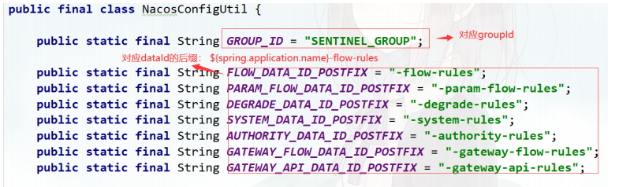

sentinel持久化的改造点：
一.sentinel客户端启动时或者sentinel的dashboard启动时
从nacos拉取所有的规则配置
二.Nacos配置中心控制台发布规则时
1.更新sentinel的内存数据
2.sentinel控制台同步规则到nacos配置中心
三.Sentinel Dashboard监听Nacos配置的变化，如发生变化就更新本地缓存
原则：
sentinel Dashboard和sentinel client 不直接通信，而是通过nacos配置中心获取到配置的变更

sentinel持久化的实现：
Sentinel 控制台提供 DynamicRulePublisher 和 DynamicRuleProvider 接口用于实现应用维度的规则推送和拉取：
DynamicRuleProvider<T>: 拉取规则    FlowRuleNacosProvider
DynamicRulePublisher<T>: 推送规则    FlowRuleNacosPublisher
第1步：在com.alibaba.csp.sentinel.dashboard.rule包下创建nacos包，然后把各种场景的配置规则拉取和推送的实现类 写到此包下
注意：微服务接入Sentinel client，yml配置需要匹配对应的规则后缀

第2步：进入com.alibaba.csp.sentinel.dashboard.controller包下修改对应的规则controller实现类

sentinel执行的步骤：
以flow流控规则为例：
1.先将流控规则封装为FlowRule，然后交给FlowRuleManager来管理【将规则放到了内存中】
2.请求过来时，会经过sentinel的链路去校验。校验流控的链路是FlowSlot
取规则：FlowRuleManager.getFlowRuleMap()
加载规则： FlowRuleManager.loadRules(rules)
》currentProperty.updateValue(rules);
    》listner.configUpdate(newValue)
        》flowRules.clear()
        》flowRules.putAll(rules);
    》flowRules 

拉模式的扩展：
HandlerInterceptor=》
    AbstractSentinelInterceptor.preHandle
        Entry entry = SphU.entry(resourceName, ResourceTypeConstants.COMMON_WEB, EntryType.IN);
            Env的InitExecutor.doInit();=》w.func.init();
                CommandCenterInitFunc
                FileDataSourceInit
